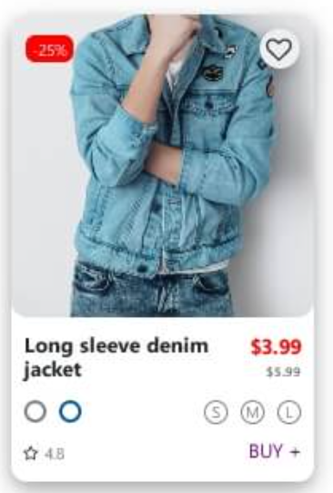

## Ejercicio integrador
---

Utilizando HTML y CSS replicar el componente que se muestra en la imagen, de la mejor manera posible, prestando atención a los detalles.

Utilizar flexbox para distribuir los elementos.

---

Una vez finalizada la interfaz, agregar una lógica utilizando JavaScript para, cuando se pasa el mouse/cursor por encima del componente, desplegar dentro de éste y por debajo del título del producto, una descripción del mismo. Utilizar eventListener para captar el 'mouseover' sobre el componente.