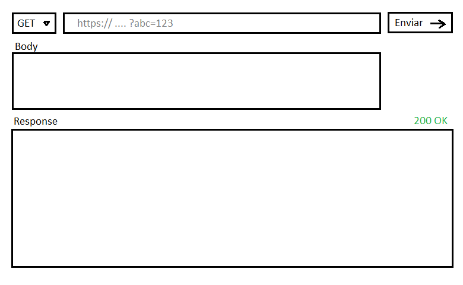

#Ejercicio integrador:

1. Hacer el código HTML para una interfaz similar a la del programa "Thunder Client" o "Postman", utilizados para enviar peticiones HTTP y mostrar la respuesta. 
Utilizar flexbox para acomodar los elementos en la página, usando las buenas prácticas para luego poder adaptar el diseño a distintas pantallas de manera responsive.
Se puede utilizar **Bootstrap**.

- El apartado de "body" solo se debe mostrar cuando el método de la request (GET, POST, etc.) seleccionado sea POST, PATCH o DELETE (no en el GET).
- El apartado de respuesta se debe borrar apenas se toca el botón de "Enviar" y llenarse cuando el servidor responda.

2) Implementar la lógica JS para que.

3) Usar CSS y/o CSS media queries para que el diseño sea responsive.

