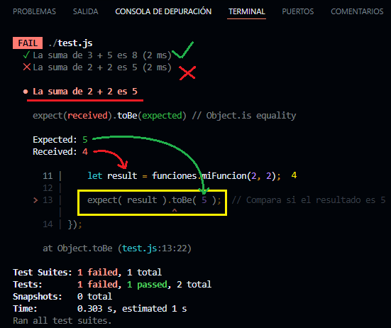

# Jest

### Configuración:
Instalar: `npm install --save-dev jest`
Agregar a `package.json` dentro del nodo "scripts":
> {
    "test": "jest"
  } 

Jest es un framework de testing de código **JavaScript**. Permite probar el comportamiento de nuestro programa o aplicación web, mediante llamados a __cada una de nuestras partes del código__ (funciones, métodos, clases, componentes, etc.) y evaluando cómo resultan o qué devuelven.

Por ejemplo

```
function miFuncion(num1, num2){
    let resultado = num1 + num2
    return resultado
}

module.exports = {miFuncion }  // exportar funciones a testear
```

La forma en que probaríamos nuestra función sería muy fácil
```
console.log( miFuncion(3, 5) );    // devuelve 8 
```
>Pondríamos un `console.log()` y correríamos el programa JS y miramos la pantalla... Fácil.

Pero... ¿qué pasaría si nuestro programa tiene **40 funciones distintas**, más complejas que la mencionada?
No podríamos estar constantemente invocando **una por una** y mirando el resultado que devuelve, para chequear si funciona bien, es un proceso que demoraría varios minutos u horas cada vez.

## Jest al rescate
Jest nos permitirá invocar a la función `miFuncion` pasándole los parámetros que nosotros definamos, comparando automáticamente el resultado que ésta devuelva, con el valor que nosotros definamos como correcto.

```
const funciones = require('./index.js')  // importar funciones a testear

test('La suma de 3 + 5 es 8', function(){
    let result = funciones.miFuncion(3, 5);
    
    expect( result ).toBe( 8 );  // Compara si el resultado es 8
});
```

Solo basta con correr el siguiente comando para que éste test (y todos los que necesitemos) se ejecuten automáticamente en cuestión de milisegundos:

> npm test

Aparecerá en la consola el resultado de los test. Si alguno tuviera un resultado distinto al esperado, nos aparecerá un mensaje de error.



## Conclusión
Los test automatizados nos permiten darnos cuenta rápidamente y durante la etapa de desarrollo si el código que hemos modificado sigue funcionando bien después de modificarlo. Sin esto sería fácil llevar errores no deseados a "producción" causando graves problemas.

Además permite que el programador que lee los test pueda interpretar cuál es exactamente el comportamiento que debe esperar de una función o clase determinada, cuando ésta fue creada por un tercero y no hay una documentación al alcance (muy frecuente).

---

# Jest para Vue.js

Ver la siguiente guía:

https://test-utils.vuejs.org/guide/essentials/a-crash-course.html